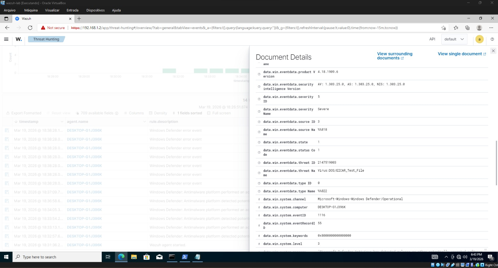
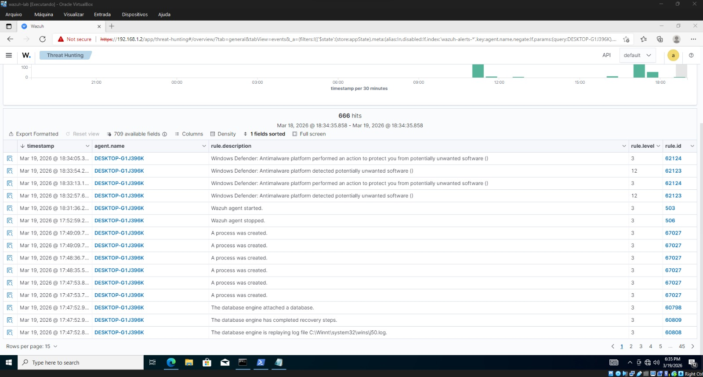
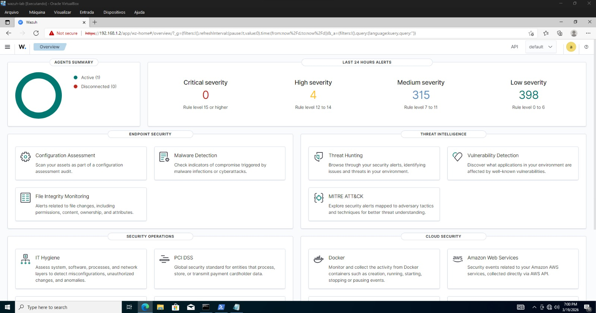
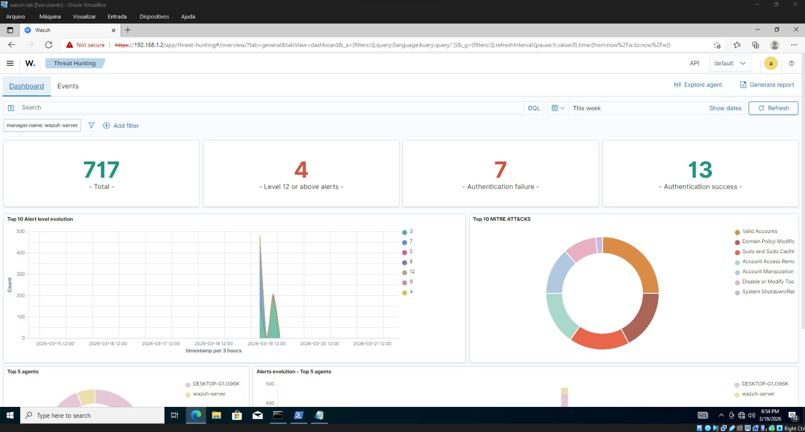
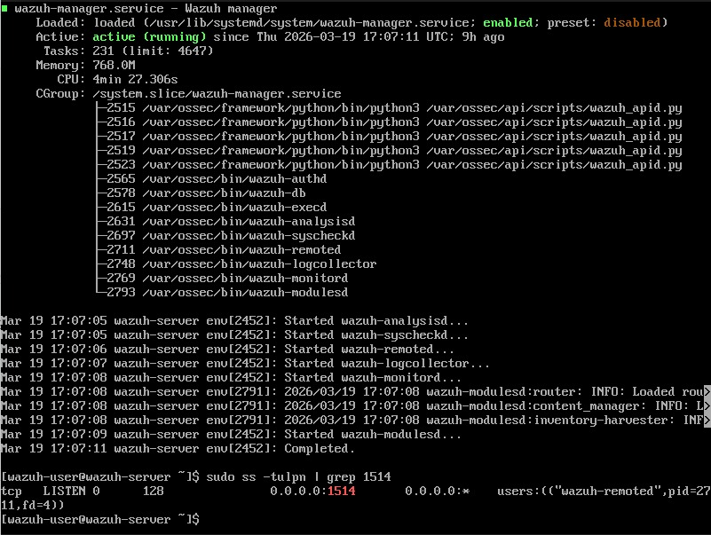

# 🛡️ Laboratório de SOC: Implementação de SIEM com Wazuh e Resposta a Incidentes

Neste repositório documentei a implementação de um ambiente de **SIEM (Security Information and Event Management)** utilizando a plataforma **Wazuh** para monitorização centralizada de um endpoint Windows e integração com o **Microsoft Defender**.

---

## 🚀 Visão Geral do Projeto
O objetivo deste laboratório foi estabelecer visibilidade total sobre eventos de segurança num ambiente virtualizado, garantindo que ameaças críticas sejam reportadas instantaneamente num servidor centralizado (Ubuntu).

### 🏗️ Arquitetura do Laboratório
* **Wazuh Manager:** Servidor Ubuntu (Instalação All-in-one).
* **Wazuh Agent:** Windows 10/11 Endpoint.
* **Comunicação:** Protocolo TCP via porta 1514.

---

## 🛠️ Desafios Técnicos e Troubleshooting (que eu resolvi)
A implementação não foi apenas uma instalação "next-next-finish". Foram superados obstáculos reais de configuração:

* **Correção de Sintaxe XML:** Identificação e correção de erros no ficheiro `ossec.conf` do agente Windows que impediam a inicialização do serviço.
* **Ingestão de Logs do Defender:** Configuração manual do canal de eventos `Microsoft-Windows-Windows-Defender/Operational` para capturar detecções que não são enviadas por padrão.
* **Gestão de Recursos:** Otimização de hardware para correr o stack completo do Wazuh Indexer e Dashboard num ambiente com recursos de RAM limitados.

---

## 🕵️ Simulação de Incidente (PoC)
Para validar o SOC, executei uma simulação de ataque baseada no framework **MITRE ATT&CK**:

### **Fase 1: Execução de Malware (EICAR)**
* **Ação:** Injeção da string de teste de malware EICAR no sistema.
* **Detecção:** O Microsoft Defender neutralizou a ameaça localmente.
* **Visibilidade SOC:** O Wazuh capturou o evento e gerou um alerta de **Alta Severidade (Nível 12-14)** no Dashboard, detalhando o tipo de ameaça e o caminho do ficheiro.

### **Fase 2: Persistência e Reconhecimento**
* **Ação:** Execução de comandos de descoberta (`whoami`, `net user`) e tentativa de criação de novos utilizadores via PowerShell.
* **Monitorização:** Captura de logs de criação de processos suspeitos e alterações na base de dados de utilizadores locais através do monitor de integridade (FIM).

### **Fase 3: Resposta e Recuperação**
* **Análise:** Através do **Threat Hunting**, foi possível confirmar a neutralização da ameaça e rastrear a origem do incidente sem necessidade de acesso direto ao endpoint.

---

## 📊 Resultados e Evidências

*  **Status do Agente:**

 

* **Alertas de Malware:**
 

* **Terminal Ubuntu:**
 

  

---

## 🧠 Conclusão e Aprendizados
Este projeto demonstrou que a segurança eficaz depende de visibilidade centralizada. Aprendi a lidar com a estrutura interna do Wazuh, a importância da auditoria de logs do Windows e, principalmente, como realizar o troubleshooting de agentes que falham na comunicação por erros de configuração XML.

---

**Tags:** #CyberSecurity #Wazuh #SIEM #SOC #BlueTeam #IncidentResponse #WindowsDefender
